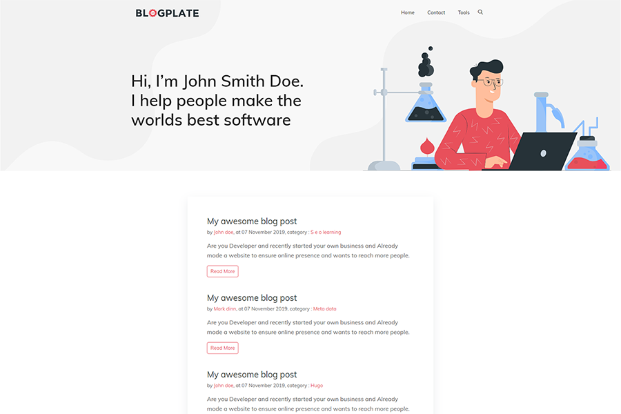

<h1 align=center>Northendlab Light  | <a target="_blank" href="https://demo.gethugothemes.com/northendlab" rel="nofollow">Demo</a> | <a  target="_blank" href="https://lighthouse-dot-webdotdevsite.appspot.com//lh/html?url=https%3A%2F%2Fdemo.gethugothemes.com%2Fnorthendlab-light%2F">Page Speed (90%)</a></h1>

<p align=center>
  <a href="https://github.com/gohugoio/hugo/releases/tag/v0.58.0" alt="Contributors">
    
  </a>

  <a href="https://github.com/gethugothemes/northendlab-light/blob/master/LICENSE">
    </a>

  

  <a href="https://github.com/gethugothemes/northendlab-light/graphs/contributors">
    </a>

  <a href="https://twitter.com/intent/follow?screen_name=gethugothemes">
    </a>
</p>

---

<p align="center">

 
</p>

---
## Features


| [Northendlab Light](https://github.com/gethugothemes/northendlab-light)                      | [Northendlab Premium](https://gethugothemes.com/products/northendlab/)                              |
| :-------------                                                                           |:-------------                            | 
| Google analytics  support                                                                | Google analytics  support                |
| CSS and Js bundle with hugo pipe                                                         | CSS and Js bundle with hugo pipe         |
| Netlify settings predefine                                                               | Netlify settings predefine               |
| Forestry cms pre-configured                                                              | Forestry cms pre-configured              |
| Contact form Support                                                                     | Contact form Support                     |
| Search by fuse.js and mark.js                                                            | Search by fuse.js and mark.js            |
| GDPR consent enable                                                                      | GDPR consent enable                      |
| Google page speed optimized ( 90% )                                                      | Google page speed optimized ( 77% )      |          
| Open graph meta tag                                                                      | Open graph meta tag                      |
| Twitter card meta tag                                                                    | Twitter card meta tag                    |
| Home Page, Contact Page and Tools Page available                                         | Premium page list ([Home Classic Page](https://demo.gethugothemes.com/northendlab/homepage/classic/), [Home Creative Page](https://demo.gethugothemes.com/northendlab/homepage/creative/), [About Page](https://demo.gethugothemes.com/northendlab/about/), [Tag Page](https://demo.gethugothemes.com/northendlab/tags/tech/), [Category Page](https://demo.gethugothemes.com/northendlab/categories/hugo/), [Elements Page](https://demo.gethugothemes.com/northendlab/elements/) )              |
|                                                                                          | Multiple language support (Fr, En)                     |
|                                                                                          | Multiple author support                              |
|                                                                                          | Header-search-layout (expanded, popupable)              |
|                                                                                          | Menu alignment customize (left, right, or center )     |
|                                                                                          | Color and fonts variable in config file                |
|                                                                                          | Sidebar option (left, right or false)                  |
|                                                                                          | Mailchimp integrate                                    |


## Local development

```bash
# clone the repository
git clone git@github.com:gethugothemes/northendlab-light.git

# cd in the project directory
$ cd northendlab-light/exampleSite/

# Start local dev server
$ hugo server --themesDir ../..
```
Or Check out [Full Documentation](https://docs.gethugothemes.com/Northendlab/?ref=github).

## Content Management System

[](https://app.forestry.io/quick-start?repo=gethugothemes/northendlab-light&engine=hugo&version=0.87.0)

This project has been pre-configured to work with [Forestry](https://forestry.io) a git-based CMS, [import your
repository in Forestry](https://app.forestry.io/quick-start?repo=gethugothemes/northendlab-light&engine=hugo&version=0.87.0) and
you will be able to edit and preview your site ✨.

Any changes you make in Forestry will be committed back to the repo and deployed if you use [Netlify](#netlify).
## Deployment and hosting

[](https://app.netlify.com/start/deploy?repository=https://github.com/gethugothemes/northendlab-light)

Follow the steps.

## Prefer a video? (Hugo + Netlify + Forestry)
Build your website with **Northendlab Light Hugo** theme by following these easy steps (No Coding Required!)
[Video Tutorial](https://youtu.be/ResipmZmpDU).

<!-- reporting issue -->
## Reporting Issues
We use GitHub Issues as the official bug tracker for the Northendlab Light Template. Please Search [existing
issues](https://github.com/gethugothemes/northendlab-light/issues). Someone may have already reported the same problem.
If your problem or idea has not been addressed yet, feel free to [open a new
issue](https://github.com/gethugothemes/northendlab-light/issues).

## Northendlab Light Hugo Powered Websites
- https://www.testlab.live
- https://www.thecommercegrind.com

Want to submit your own website powered by Northendlab Light Hugo? You can submit it [here](https://github.com/gethugothemes/northendlab-light/discussions/19).

<!-- licence -->
## License
Copyright &copy; Designed by [Themefisher](https://themefisher.com) & Developed by
[Gethugothemes](https://gethugothemes.com)

**Code License:** Released under the [MIT](https://github.com/gethugothemes/northendlab-light/blob/master/LICENSE) license.

**Image license:** The images are only for demonstration purposes. They have their licenses. We don't have permission to
share those images.

<!-- resources -->
## Special Thanks
- [Bootstrap](https://getbootstrap.com)
- [Jquery](https://jquery.com)
- [Themify Icons](https://themify.me/themify-icons)
- [Fuse Js](http://fusejs.io)
- [Mark Js](https://markjs.io/)
- [Google Fonts](https://fonts.google.com)
- [All Contributors](https://github.com/gethugothemes/northendlab-light/graphs/contributors)


## Hire Us
We are available for **Hiring** for your next HUGO project. Please, check our
[services](https://gethugothemes.com/services/?ref=github)

<!-- premium themes -->
## Premium Themes By Us
| [](https://gethugothemes.com/bundle) | [](https://gethugothemes.com/products/airspace/) | [](https://gethugothemes.com/products/bigspring/) |
|:---:|:---:|:---:|
| **Premium Theme Bundle (40+)** | **Airspace** | **Bigspring** |